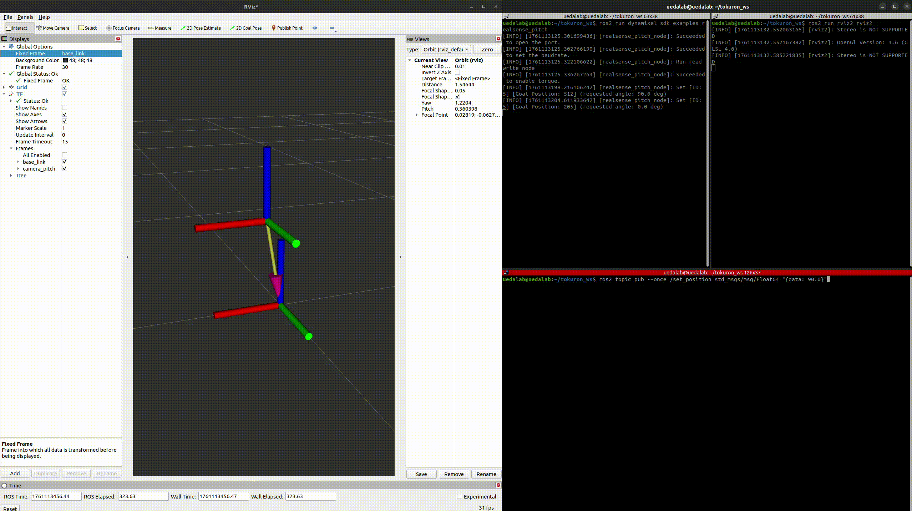

# dynamixel_sdk_examples

The `realsense_pitch` node drives a DYNAMIXEL servo as a pitch axis and publishes the current angle both as a topic and as a TF frame.



## Build

From the root of the workspace, run:

```bash
colcon build --symlink-install
source install/setup.bash
```

## Topics

| Topic              | Type                    | Direction  | Description                                   |
|--------------------|-------------------------|------------|-----------------------------------------------|
| `/set_position`    | `std_msgs/msg/Float64`  | subscribe  | Target angle in degrees (effective range ~0–100°). |
| `/present_angle`   | `std_msgs/msg/Float64`  | publish    | Measured angle in degrees.                    |

TF is broadcast at the same rate from `parent_frame` (default `base_link`) to `child_frame` (default `camera_pitch`). The translation offset is configured via `frame_offset_x/y/z` (default: x = 0.042 m, z = 0.260 m).

## Running the sample

1. Connect the servo and, if necessary, edit `config/realsense_pitch.yaml`. Key parameters include `fixed_dxl_id`, `present_angle_publish_hz`, and `parent_frame`.
2. Start the node:

	```bash
	ros2 run dynamixel_sdk_examples realsense_pitch \
	  --ros-args --params-file <path-to-workspace>/src/DynamixelSDK_tokuron/ros/dynamixel_sdk_examples/config/realsense_pitch.yaml
	```

3. Send a target angle—for example, 30 degrees:

	```bash
	ros2 topic pub --once /set_position std_msgs/msg/Float64 "data: 30.0"
	```

4. Check the feedback:

	- Angle: `ros2 topic echo /present_angle`
	- Visualization: launch `ros2 run rviz2 rviz2`, add a TF display, and inspect the `camera_pitch` frame.

When you exit the node with Ctrl+C, torque is released automatically.


